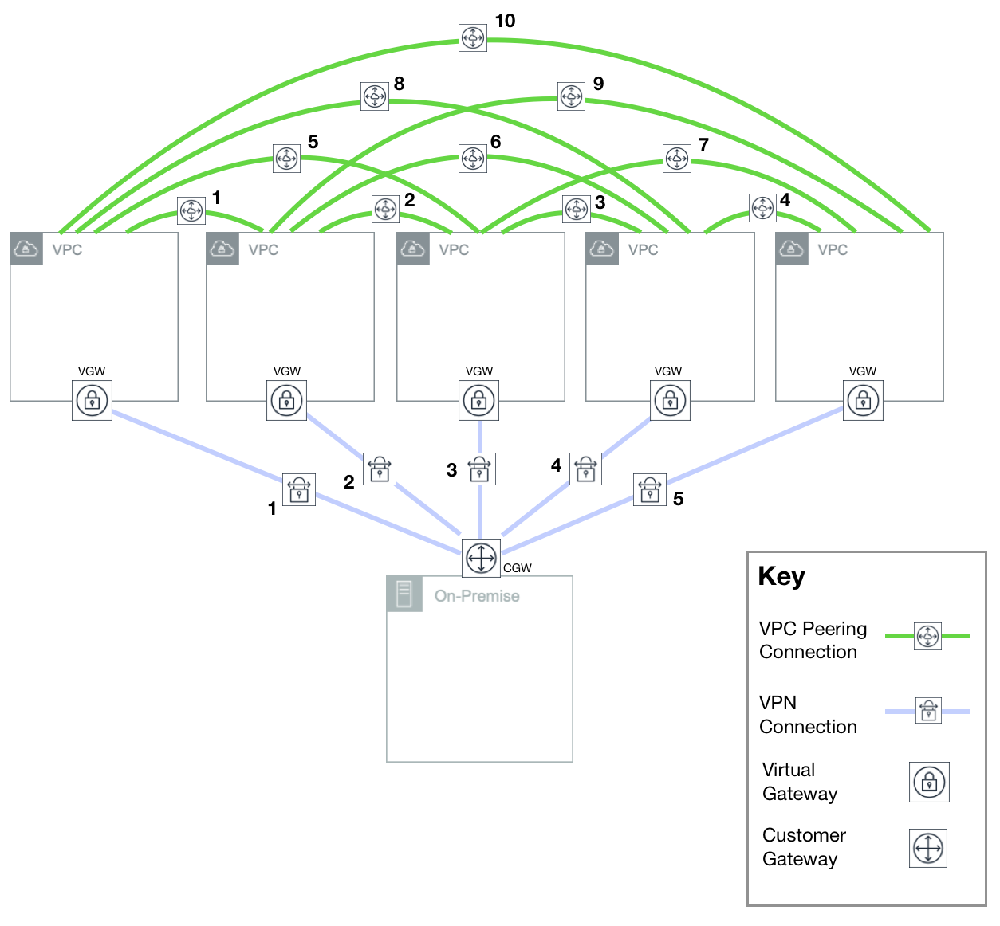
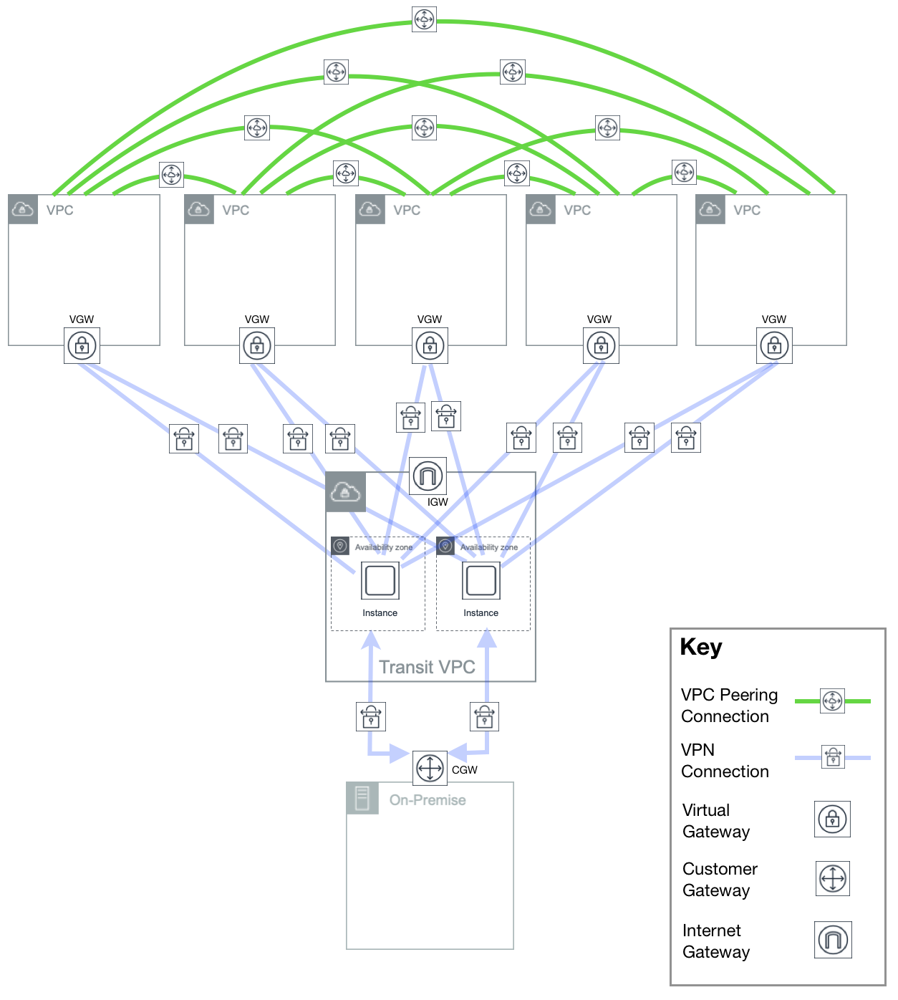
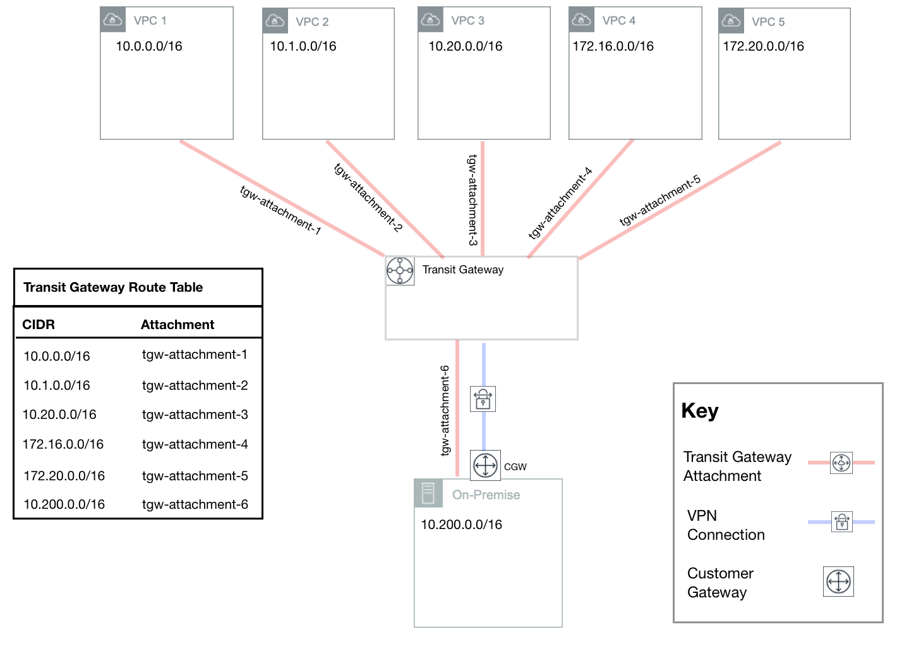
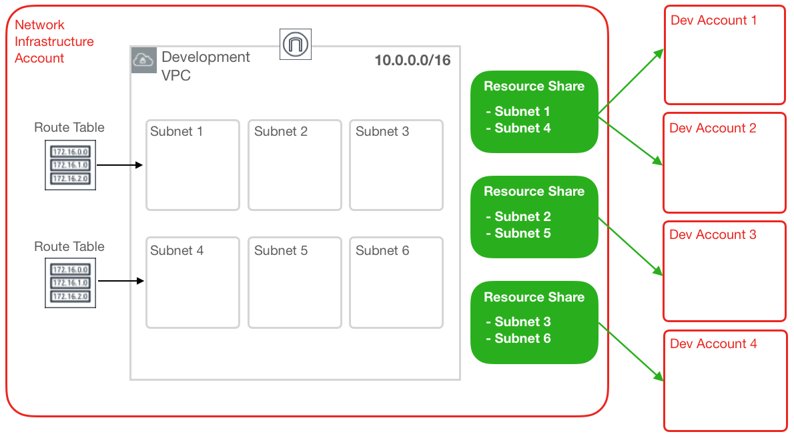

# Next-Generation Networking with AWS Transit Gateway

An huge announcement in Amazon Web Services networking space happened fairly recently, it was the release of **AWS Transit Gateway** and the introduction of **Shared VPCs** has particularly caught my attention, and has been one of my recent obsessions. AWS Transit Gateway is a truly game-changing technology, as it provides a central hub for connecting AWS VPCs and VPNs, while Shared VPC eases the pain of managing multiple VPCs by allowing you to centrally manage and distribute them to accounts.

Considering the array of cutting-edge services at your fingertips within the AWS platform, it's fairly easy to understand why a core topic such as network architecture often draws less of a crowd, or the ire of most. Let's face it, networking isn't really an exciting topic to us _tech-types_.

**But answer me this**: Would you build a new house without first knowing that the foundations were solid?

While I am amazed by AWS and their continued product releases in areas such as IoT (Internet of Things), real-time data streaming and now even Satellite communication, I remain passionate about fundamentals, such as multi-account strategies, governance at scale and network architectures in the cloud. As a Cloud Architect and Evangelist, these are the foundations that pave the way for success in our respective journeys with all cloud ecosystems, not just AWS.

I'll start by discussing the historical challenges of networking at scale in AWS, then outlining each service and discussing how I believe their combination will alter the design of foundational network architecture in AWS going forward.

### The Challenges of Networking at Scale in AWS

As organisations move into AWS, [Virtual Private Clouds](https://docs.aws.amazon.com/vpc/latest/userguide/what-is-amazon-vpc.html) (VPCs) have been identified as the stanfdard and defacto way to seggregate workloads from one another. In the case you are new to VPCs or are still trying to understand their role, here's a quick refresher. A VPC allows you to provision a logically isolated section of the AWS cloud where you are allowed to launch resources into a virtual network that you define. In the scenario where resources within two separate VPCs require the ability to communicate, a VPC peering connection ([I've written on this topic in the past](https://github.com/ehime/paper-vpcpeering)) is created to enable this. In addition to communication between VPCs, most organizations typically will also have a requirement for some type of hybrid connectivity, utilizing VPNs or AWS [Direct Connect](https://docs.aws.amazon.com/directconnect/latest/UserGuide/Welcome.html) to connect VPCs to On-Premise networks. At a small scale, involving only a few VPCs, connectivity is _manageable_ at best. Consider the following example, with _5 VPCs_ that we would like to connect via peering in addition to On-Premise via VPN:

<b>Image 1:</b> Counting the number of connections required to connect VPCs to each other and On-Premise

As you can see, 5 interconnected VPCs which are also connected to an On-Premise location require 10 distinct VPC peering connections and 5 VPN connections. For true redundancy, there would also be an additional 5 VPN connections to a second Customer Gateway (CGW) On-Premise.

<b>Image 2:</b> Growth of peering connections required to connect VPCs in a full-mesh network

_**Image 2**_ shows how the number of peering connections required to connect VPCs in a [full-mesh network](https://www.webopedia.com/TERM/M/mesh.html) grows exponentially as the number of VPCs increases. The scenario illustrated in _**Image 1**_ is slightly far-fetched as it's unlikely that all VPCs will require a peering connection in a real-world solution. However, it helps to show how quickly the number of connections can grow given VPC peering requirements.

In addition to VPC peering connection requirements, as the number of VPCs owned by an organization has grown from tens to hundreds to thousands, the creation and management of connections from VPCs to On-Premise infrastructure has proven to be a major challenge. To tackle this, AWS introduced a [Transit VPC solution](https://aws.amazon.com/blogs/aws/aws-solution-transit-vpc/) in mid-2016, as shown in _**Image 3**_ below.

<b>Image 3:</b> A sample Transit VPC solution and associated connectivity between VPCs

A [Transit VPC solution](https://aws.amazon.com/blogs/aws/aws-solution-transit-vpc/) uses host-based VPN appliances in a dedicated VPC to perform transitive routing between networks through a central hub. The introduction of additional VPCs only requires new VPN connections between the host devices and the VPC, rather than additional connections to the On-Premise CGW. Although reducing the number of On-Premise connections, dedicated host appliances add additional cost and management overhead. In addition, his solution will not help to reduce the number of VPC peering connections required.

### AWS Transit Gateway

Considering the challenges discussed above, the release of AWS Transit Gateway is an exciting development. Utilizing Transit Gateway, you only need to create and manage a single connection, this is called a Transit Gateway Attachment, these exist between the Gateway and each Amazon VPC (or additionally in your On-Premise locations). The Transit Gateway will maintain its own routing tables, these are separate from the route tables associated with subnets within individual VPCs.

<b>Image 4:</b> High-Level Overview of Transit Gateway, Transit Gateway Attachments, and Transit Gateway Route Table

AWS Transit Gateway removes the need to configure peering connections between VPCs that need to communicate. Instead, each individual VPC is associated with the Transit Gateway using a Transit Gateway Attachment, as shown in _**Image 4**_. The Transit Gateway Routing Table (also shown in _**Image 4**_) contains a complete list of all VPCs and VPNs associated with the Transit Gateway and their respective Transit Gateway Attachments. Within the routing tables associated with a particular VPC subnet (example shown in _**Image 5**_), traffic destined for another VPCs CIDR range is simply directed towards the source VPCs Transit Gateway Attachment. Once traffic reaches the Transit Gateway via that attachment, the Transit Gateway Route Table is used to determine which attachment to use to send the traffic to its final destination.

In addition to making it easier to interconnect VPCs, AWS Transit Gateway removes the cross availability-zone data charges that exist when utilizing VPC peering connections. Instead, AWS Transit Gateway charges a flat fee per Transit Gateway attachment and then per GB of data that flows through the Gateway, regardless of source and destination. Information on Transit Gateway pricing can be [found here](https://aws.amazon.com/transit-gateway/pricing/).

The Transit Gaetway serves as the central network connectivity hub, thus replacing (in most circumstances) the requirements shown in _**Image 3**_. Instead, VPN connections are associated with the Transit Gateway via a Transit Gateway Attachment in the same way that VPCs are. With this, traffic from On-Premise networks can be directed to any other network attached to the Transit Gateway as long as route table entries allow it to do so. Although VPN traffic is limited to a 1.25 Gbps bandwidth per VPN tunnel, Transit Gateway includes Equal Path Multi-Cost (ECMP) routing support. Assuming the other end of the VPN connection supports ECMP, traffic can be equally distributed between any number of VPN connections to scale the effective bandwidth.

Although Transit Gateway greatly simplifies the management of connections from AWS to On-Premise networks, organizations may prefer to utilize a Transit VPC solution if they require additional monitoring and visibility or further security features, such as:

  - Outbound URL filtering
  - Firewall devices
  - Intrusion Detection and Prevention (IDP)
  - Unified Threat Management (UTM)

In the cases such as above, Transit Gateway and Transit VPC solutions can be used, and are recommended to achieve these goals.

AWS Transit Gateway is a welcome release that solves a number of networking related challenges. However, additional functionality is expected in 2019 that will further increase its value for organizations of all sizes. At present, hybrid connectivity between AWS Transit Gateway and On-Premise networks can only be established via VPN connections. Although Transit Gateway supports VPN connections with [ECMP](https://en.wikipedia.org/wiki/Equal-cost_multi-path_routing) enabled, support for AWS Direct Connect is also slated to be released early 2019. This will allow for multi-Gbps connections in and out of the Transit Gateway via a single connection. In addition to added support for AWS Direct Connect, AWS have indicated that they will soon make it possible to connect Transit Gateways in separate AWS Regions via the release of Transit Gateway Peering. This will allow organizations to build globally distributed networks with minimal effort.

### Shared VPCs

The release of Virtual Private Cloud (VPC) functionality was one of the first steps towards the logical isolation of workloads in AWS, this was a huge departure from the historic [EC2 CLassic network](https://docs.rightscale.com/faq/clouds/aws/What_is_an_EC2-Classic_network.html). with so many corporations having migrated their workloads to AWS in the years since, often creating hundreds to thousands of VPCs to support a wide variety of use cases. As discussed when outlining the challenges of networking at scale in AWS, the management of this many VPCs can take significant time and effort.

AWS has always prided themselves as being a customer-focused company, with approximately 95% of all service releases coming as a result of user feedback. In this case, persistent requests from customers challenged AWS to make the management of VPCs at scale easier. Unveiled at the last re:Invent, their solution was to introduce Shared VPCs. Simply put, VPC sharing allows for many AWS accounts to create their resources within a centrally managed VPC. The AWS account that creates and owns the VPC can choose to share particular subnets with other AWS accounts within the same [AWS Organization](https://aws.amazon.com/organizations/). Once a particular subnet is shared with an account, it can then create, view and modify resources it owns within those particular subnets.

<b>Image 6:</b> Sharing a VPC with multiple AWS Accounts using Resource Shares

Looking at _**Image 6**_, imagine you want to create a VPC that you can share with all of the development level accounts for a particular business unit. If you allocate the largest VPC CIDR block possible, 16-bits, this provides you with **65,536** IP addresses that can be grouped and shared using subnet sizes of your choice. For example, you could create `256` subnets of size `/24` (each with 256 IP addresses) or 1024 subnets of size `/26` (each with 64 IP addresses). Once you have defined your subnets, you can then share any of them with any account within your AWS Organization using a Resource Share. To implement a granular level of segmentation, subnet NACLs can be used to fence off access between specific subnets, ports or destinations.

While it's true that utilizing Shared VPCs can reduce the number of VPCs and overall management burden, it's important to realize that it's not a **one-size-fits-all** solution. Significant thought needs to be put into how many VPCs to utilize and how to share their subnets between accounts.

For example, some questions to ask include:

  - At what level will VPCs be defined? — Per line of business? Per team? Per project?
  - Which VPCs should route traffic to one another? Should certain subnets have dedicated route tables?
  - Which VPC subnets require strict traffic flow management using subnet NACLs?

Working together as an organization to answer questions such as these and define all aspects of network management is extremely important.
